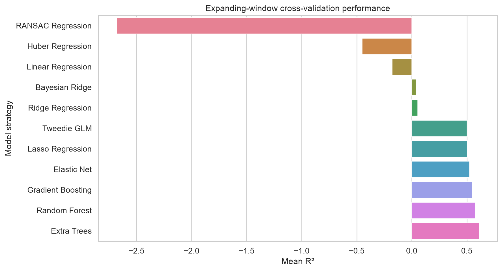
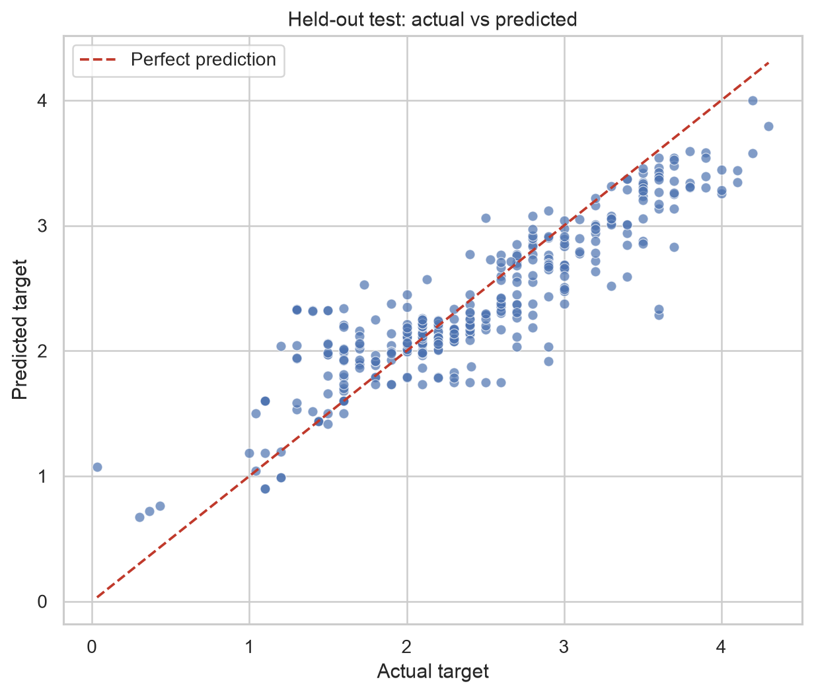
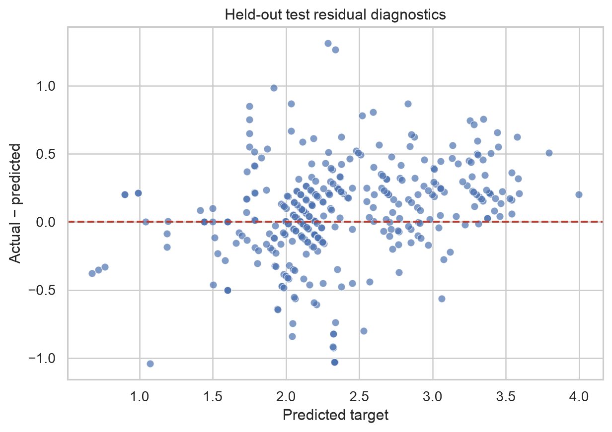
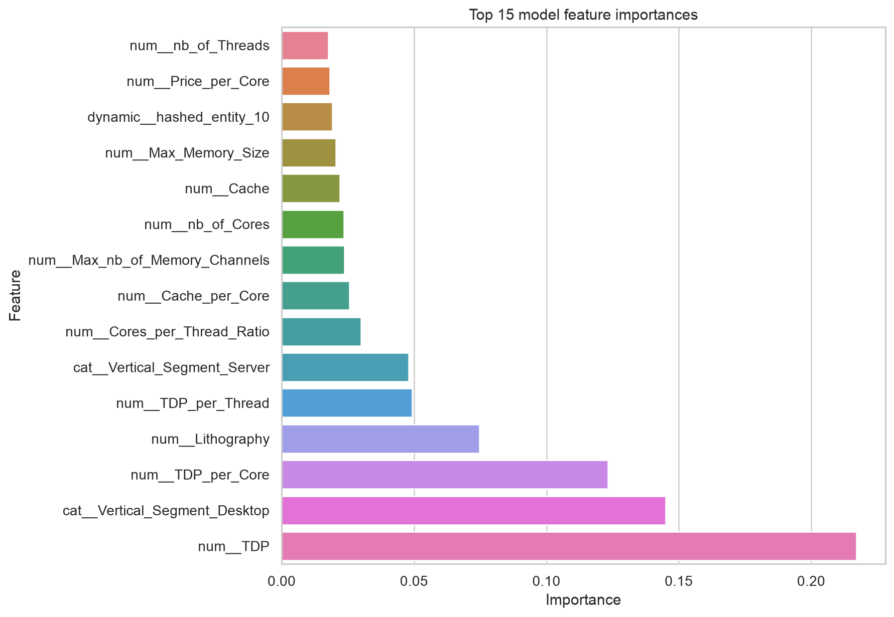
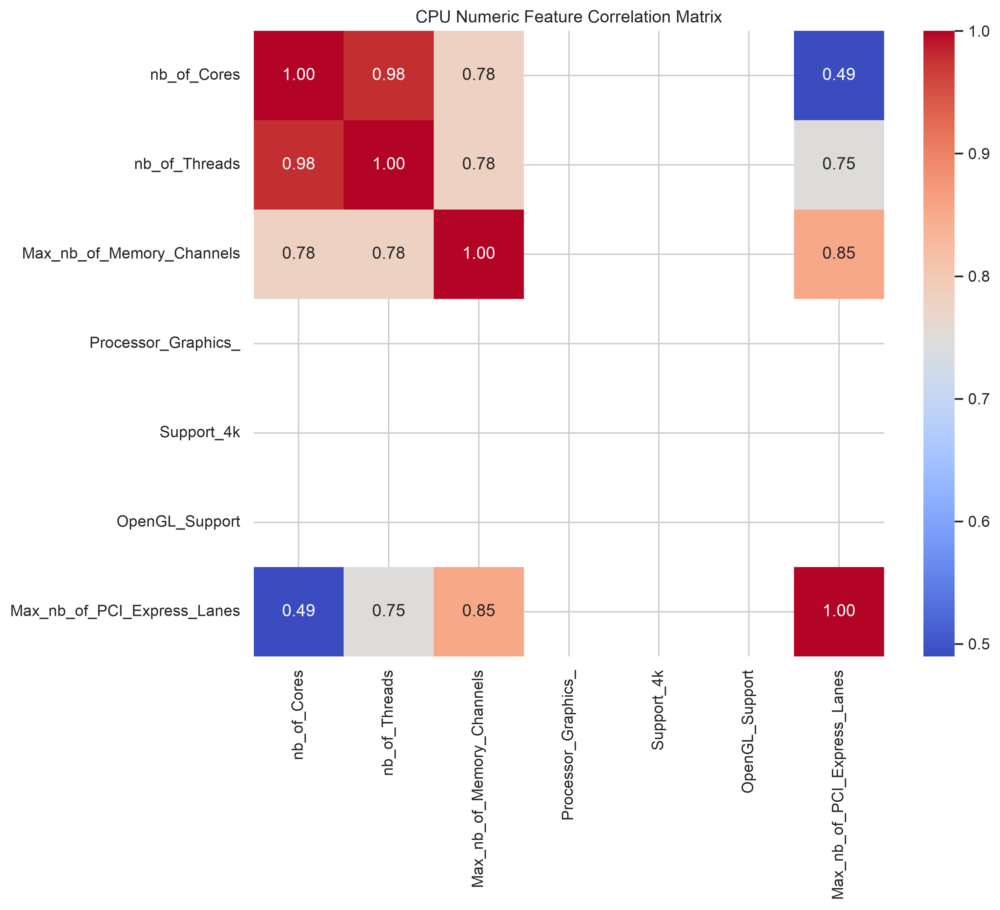
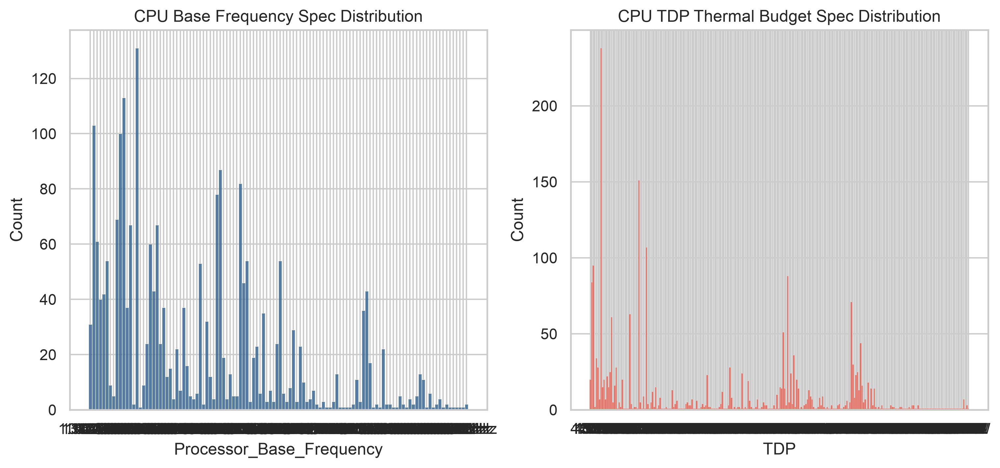

# CPU hardware benchmark model report

- **Run ID:** `86f5f80803cf4a71826380685ae6605b`
- **Dataset:** `data/raw/Intel_CPUs.csv`
- **Target:** `Processor_Base_Frequency`
- **Champion:** Extra Trees
- **Pipeline duration:** 7.735s

## Decision

**Quality gate: PASSED — champion eligible for registry promotion.** All configured quality gates passed.

## Held-out future test performance

| R² | RMSE | MAE | MAPE |
| --- | --- | --- | --- |
| 0.7813 | 0.3590 | 0.2659 | 21.37% |

The held-out partition contains the newest 20% of records. Model selection uses five expanding temporal folds on the earlier training partition; this avoids learning from future hardware releases.

## Candidate comparison



| Model | CV_R2_Mean | CV_R2_Std | CV_R2_95CI | CV_RMSE_Mean | CV_MAE_Mean | CV_MAPE_Percent_Mean |
| --- | --- | --- | --- | --- | --- | --- |
| Extra Trees | 0.6107 | 0.2144 | 0.1879 | 0.4039 | 0.3166 | 21.9791 |
| Random Forest | 0.5758 | 0.2394 | 0.2099 | 0.4203 | 0.3310 | 23.0866 |
| Gradient Boosting | 0.5509 | 0.2357 | 0.2066 | 0.4342 | 0.3443 | 20.2386 |
| Elastic Net | 0.5240 | 0.0883 | 0.0774 | 0.4670 | 0.3760 | 27.6427 |
| Lasso Regression | 0.5029 | 0.0903 | 0.0791 | 0.4773 | 0.3823 | 28.3198 |
| Tweedie GLM | 0.5007 | 0.0902 | 0.0790 | 0.4787 | 0.3905 | 26.9371 |
| Ridge Regression | 0.0535 | 0.9269 | 0.8124 | 0.6151 | 0.4411 | 28.0616 |
| Bayesian Ridge | 0.0412 | 0.9458 | 0.8290 | 0.6179 | 0.4422 | 28.2096 |
| Linear Regression | -0.1796 | 1.2571 | 1.1019 | 0.6782 | 0.4697 | 28.9610 |
| Huber Regression | -0.4519 | 1.8349 | 1.6084 | 0.7266 | 0.4860 | 29.5260 |
| RANSAC Regression | -2.6807 | 5.6041 | 4.9122 | 1.0633 | 0.5146 | 35.4846 |

## Held-out diagnostics





## Model interpretation



## Data overview





## Data quality and lineage

- Raw rows validated: 2283
- Cleaned rows: 1845
- Feature snapshot: `outputs/runs/86f5f80803cf4a71826380685ae6605b`
- Numeric imputation, scaling, categorical encoding, and feature hashing are fit only on training folds.
- Dynamic entity fields are feature-hashed, so unseen product families can be represented without changing the feature contract.

## Reproduce

```bash
uv run python scripts/run_pipeline.py
```

For the containerized run and MLflow UI, use `docker compose up -d --build`, then run `docker compose exec -T api-server python scripts/run_pipeline.py`.
