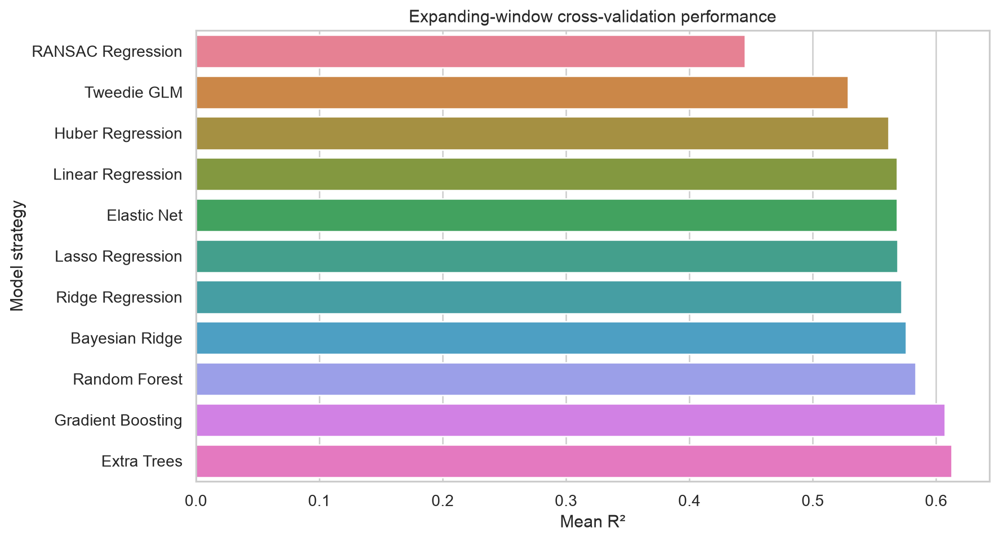
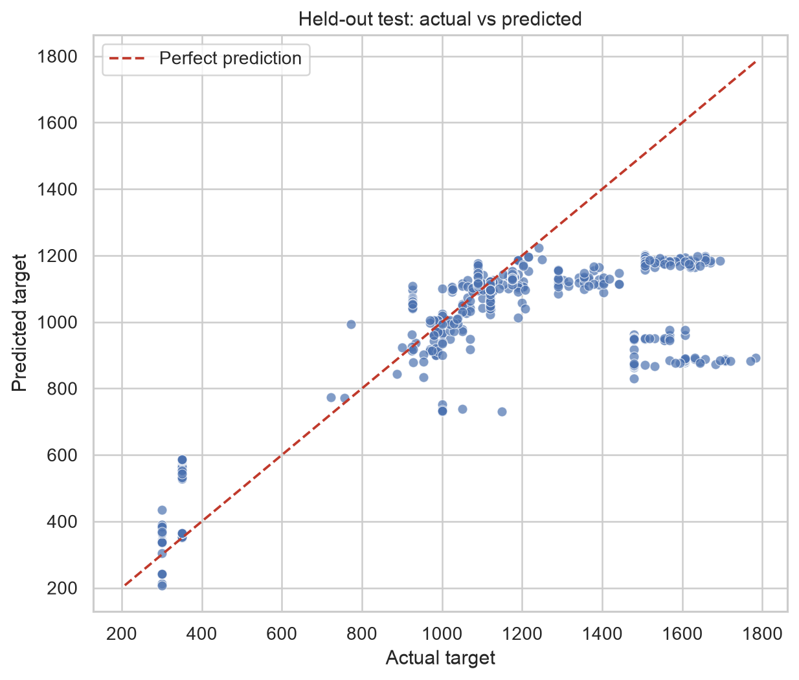
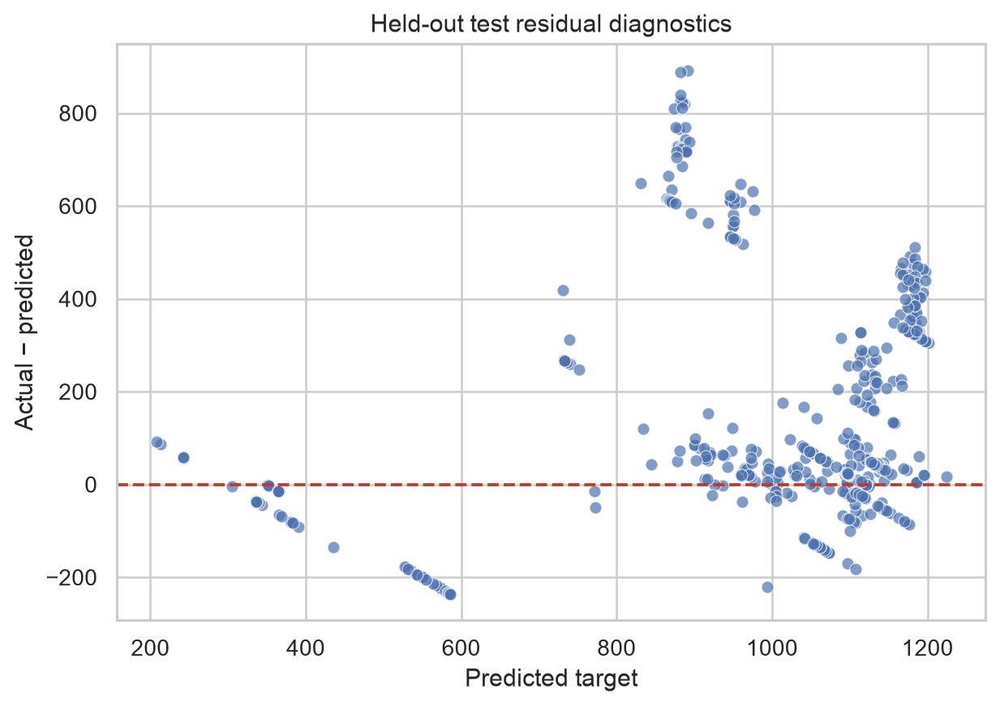
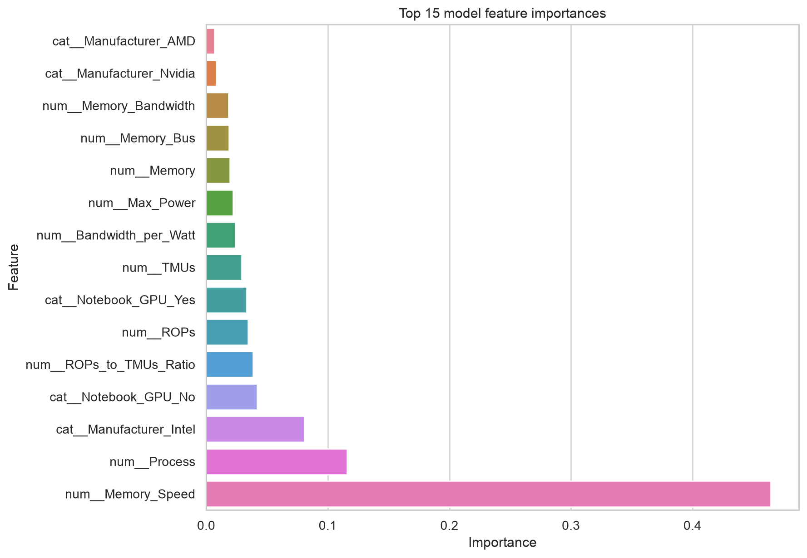
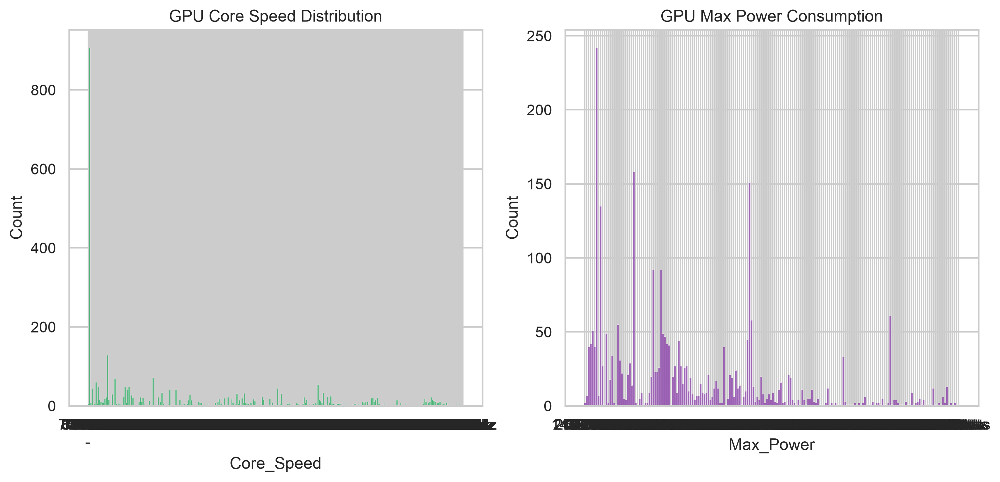

# GPU hardware benchmark model report

- **Run ID:** `f241659d48f34b228ddd3815ebd0d16c`
- **Dataset:** `data/raw/All_GPUs.csv`
- **Target:** `Core_Speed`
- **Champion:** Extra Trees
- **Pipeline duration:** 9.182s

## Decision

**Quality gate: FAILED — champion was not promoted.** R2 score (0.2847) below gate threshold (0.6000); RMSE (317.9676) exceeds maximum threshold (300.0000); MAPE (18.11%) exceeds maximum threshold (15.00%)

## Held-out future test performance

| R² | RMSE | MAE | MAPE |
| --- | --- | --- | --- |
| 0.2847 | 317.9676 | 218.1585 | 18.11% |

The held-out partition contains the newest 20% of records. Model selection uses five expanding temporal folds on the earlier training partition; this avoids learning from future hardware releases.

## Candidate comparison



| Model | CV_R2_Mean | CV_R2_Std | CV_R2_95CI | CV_RMSE_Mean | CV_MAE_Mean | CV_MAPE_Percent_Mean |
| --- | --- | --- | --- | --- | --- | --- |
| Extra Trees | 0.6124 | 0.0681 | 0.0597 | 111.7672 | 83.5510 | 10.1018 |
| Gradient Boosting | 0.6071 | 0.0799 | 0.0700 | 112.9954 | 88.4305 | 10.7142 |
| Random Forest | 0.5834 | 0.1107 | 0.0970 | 113.4796 | 85.8489 | 10.6940 |
| Bayesian Ridge | 0.5754 | 0.1356 | 0.1189 | 113.9963 | 87.9107 | 12.4694 |
| Ridge Regression | 0.5718 | 0.1460 | 0.1280 | 113.7612 | 87.8851 | 12.3415 |
| Lasso Regression | 0.5688 | 0.1518 | 0.1331 | 113.8571 | 87.8968 | 12.3113 |
| Elastic Net | 0.5684 | 0.1353 | 0.1186 | 115.0816 | 88.6954 | 12.6233 |
| Linear Regression | 0.5682 | 0.1521 | 0.1333 | 113.9359 | 87.9622 | 12.3159 |
| Huber Regression | 0.5614 | 0.1414 | 0.1239 | 115.4771 | 89.4795 | 12.3271 |
| Tweedie GLM | 0.5286 | 0.1205 | 0.1056 | 121.4481 | 96.0509 | 13.0148 |
| RANSAC Regression | 0.4453 | 0.1669 | 0.1463 | 131.5628 | 100.9537 | 14.2139 |

## Held-out diagnostics





## Model interpretation



## Data overview



## Data quality and lineage

- Raw rows validated: 3406
- Cleaned rows: 2442
- Feature snapshot: `outputs/runs/f241659d48f34b228ddd3815ebd0d16c`
- Numeric imputation, scaling, categorical encoding, and feature hashing are fit only on training folds.
- Dynamic entity fields are feature-hashed, so unseen product families can be represented without changing the feature contract.

## Reproduce

```bash
uv run python scripts/run_pipeline.py
```

For the containerized run and MLflow UI, use `docker compose up -d --build`, then run `docker compose exec -T api-server python scripts/run_pipeline.py`.
